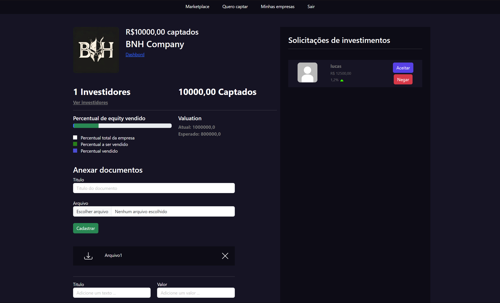

# PYSTACKINVESTORS

**The PystackInvestor** is a project developed in Python and Django during the Pythonando PystackWeek, that aims to connect startups with potential investors. The platform allows startups to showcase their products/services and investors to find opportunities aligned with their investment goals.

## Features

- **Startup Registration**: Startups can create profiles, add information about their products/services, and funding goals.
- **Investor Registration**: Investors can register, set their areas of interest, and explore startups that meet their criteria.
- **Smart Matching**: The platform offers a matching system that suggests startups and investors based on interests and profiles.
- **Proposal System**: Investors can make proposals to startups. It is up to the startups to accept or reject these proposals.
- **Dashboard**: Dashboards for startups and investors to manage profiles, messages, and opportunities.

## Technologies Used

- **Python**: Primary programming language.
- **Django**: Web framework for application development.
- **SQLite**: Database management system.
- **HTML/CSS**: Frontend technologies for user interface.

# ___________________________________________________________________________
# PT-BR
  
**O PystackInvestor** é um projeto desenvolvido em Python e Django durante a PystackWeek da Pythonando, que visa conectar startups com investidores em potencial. A plataforma permite que startups apresentem seus produtos/serviços e que investidores encontrem oportunidades alinhadas com seus objetivos de investimento.

## Funcionalidades

- **Cadastro de Startups**: Startups podem criar perfis, adicionar informações sobre seus produtos/serviços e objetivos de financiamento.
- **Cadastro de Investidores**: Investidores podem se cadastrar, definir suas áreas de interesse e explorar startups que atendem aos seus critérios.
- **Matching Inteligente**: A plataforma oferece um sistema de matching que sugere startups e investidores com base em interesses e perfis.
- **Sistema de Propostas**: Investidores podem fazer propostas para startups. Cabe às startups aceitar ou recusar essas propostas.
- **Painel de Controle**: Dashboards para startups e investidores para gerenciar perfis, mensagens e oportunidades.

## Tecnologias Utilizadas

- **Python**: Linguagem de programação principal.
- **Django**: Framework web para desenvolvimento de aplicações.
- **SQLite**: Sistema de gerenciamento de banco de dados.
- **HTML/CSS**: Tecnologias de frontend para interface de usuário.
